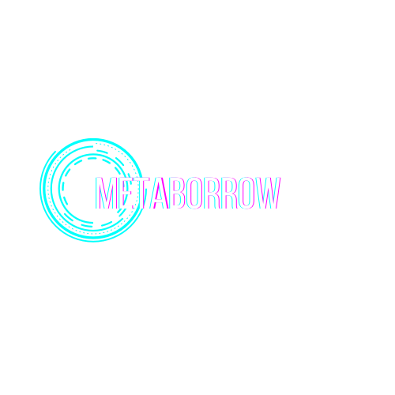
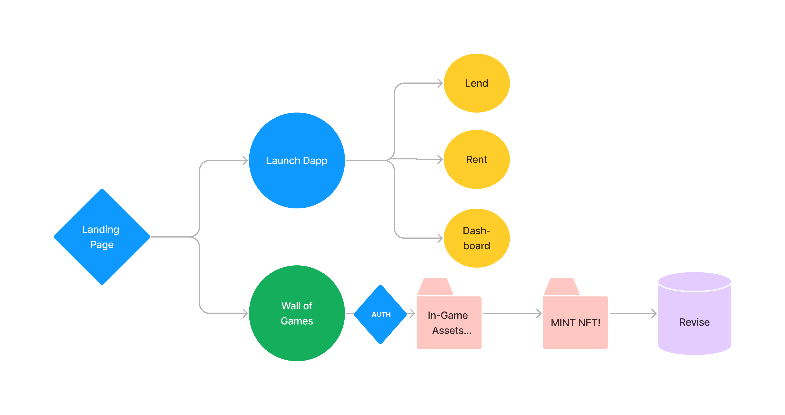

## METABORROW

MetaBorrow’s mission is to accelerate the transition of crypto and non-crypto games towards a decentralised future by lending and borrowing the gaming assets using the staking mechanisms.

We are committed to empowering the gaming experience by helping gamers generate income through their gaming assets and save money at the same time by letting gamers rent in-game assets instead of buying them. 
MetaBorrow unlocks an untapped secondary market around in-game assets where both the game developers and gamers generate profit through an open, transparent and decentralised revenue sharing model on every transactions done in an in-game asset on the platform.

Welcome to the Gaming DeFi future!

As the user lands on our application, he/she can view or lend/borrow their digital gaming assets. For renting and borrowing the gaming NFT, the user need to click on "Launch Dapp". After clicking the button the user needs to connect the web application with the MetaMask account. Thereby,the user has three options: Rent, Lend and Dashboard.

Lender specifies a number of parameters

a. maximum number of days that his/her gaming NFT can be rented out for 

--why we are including this? we don't want renters to hold on to the gaming NFTs for too long

b. daily rent price

c. Gaming NFT price. In case the gaming NFT is not returned, the lender is entitled to claim the collateral.

d. Payment token. The lender receives rent payments in this token. Collateral is priced in this token, as well.

Lender lends NFT(s)
Renter agrees to the terms and pays full collateral and all of the rent up front

Renter returns in time

4a. Unused rent amounts + collateral gets returned to the renter

4b. NFT(s) is/are returned to the lender and deposited back into the ReNFT contract why? so that the lender does not have to re-deposit the NFT(s) back for lending

Renter does no return in time

5a. Lender claims the collateral

5b. Collateral along with full rent payment gets sent to the lender

# WALL OF GAMES SECTION
In the wall of games section, we have 12 games in which if you click any of your favourite game, it will lead you to an authorization page and it will display you all of your gaming assets you possess.. If you click Mint NFT, there will be a creation of Dynamic NFT in which once deployed, you don't need to deploy it again and again when changes occurs in the data. If changes occur, it will automatically make the new changes in the NFTs!

